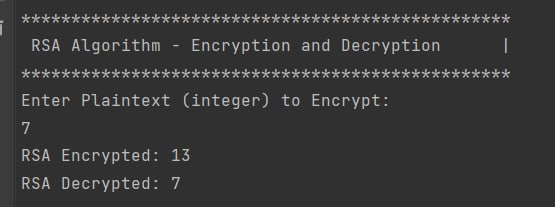

# Asymmetric ciphers laboratory

#### Author: George Vragalev

# Theory

Asymmetric encryption allows users to encrypt information using shared keys.
Public and private keys are used to encrypt and decrypt sensitive messages throughout this procedure.

Anyone can encrypt messages using a public key, but only the intended
recipient can decrypt them with
their private key using cryptography. Only the key's creator
has access to a private key, also known as a secret key.

RSA encryption algorithm is a type of public-key encryption algorithm.
This means that it is that type of alhorithm in which the encryption and decryption
keys used by the sender and the receiver are distinct. A set of keys is given to each sender: private key and public
key.
The Public key is used for encryption, and the Private Key is used for decryption.

The actions that follow demonstrate how it functions:

1. Generating the keys.

- Choose the big prime numbers x and y.
- Multiply these numbers to find n = x * y.
- Compute the totient function:
  ϕ(n)=(x−1)(y−1).
- Choose an integer e, such that e is co-prime to ϕ(n)
  and 1<e<ϕ(n).The pair of numbers (n,e) makes up the public key.
- Further calculate private Key, d :
  d = (k*Φ(n) + 1) / e for some integer k.

2. Encryption.
   Given a plaintext, represented as a number, the ciphertext is calculated as:
   cipherText = plaintext^{e} mod n.

3. Decryption.
   Using the private key (n,d), the plaintext can be found using:
   plaintext = cipherText^{d} mod n.

# Objectives:

1. Get familiar with the asymmetric cryptography mechanisms.
2. Implement an example of an asymmetric cipher.
3. As in the previous task, please use a client class or test
   classes to showcase the execution of your programs.

# Implementation description

The same CiphersControl class lets you run the program infinitely until you decide to quit.
It invokes the rsa cipher via dependency and runs the interface method.

To start with RSA implementation consists of 2 classes,
first one represent an interface with two methods
encrypt() and decrypt() with given parameter, the text.
The second class implements the interface
with its methods.

### RSA Cipher

To encrypt()...
First, choose two numbers x and y. Then n is calculated by the formula: n = x * y; the encrypt() method takes
Argument an integer plain text. To continue, choose an integer e such that e should be coprime to phi(φ(n)) and 1<
e < phi; then calculate the ciphertext using the mathematical equation: ciphertext = ((plainText.pow(e)%n),
where n is calculated by the following formula: n = x * y;

````
 public int Encrypt(int plainText)
    {
        for (_e = 2; _e < _phi; _e++)
        {
            if (Gcd(_e, _phi) == 1)
            {
                break;
            }
        }

        var ciphertext = (int) ((Math.Pow(plainText, _e)) % _n);

        return ciphertext;
    }
````

To decrypt() method takes the cipher text and proceed. The private key d is computed d = ((i * Φ(n) + 1) / e), where i should be an integer value 0 < i <= 9; Following the decryption process of the cipher text using the mathematical expression:
decryptedText = (cipherText.pow(d)).mod(n), where n is previously computed through: n = x * y;
````
 public BigInteger Decrypt(int cipherText) {
        BigInteger decryptedText;

        for (int i = 0; i <= 9; i++) {
            int x = 1 + (i * _phi);
            if (x % _e == 0) {
                _d = x / _e;
                break;
            }
        }
        BigInteger N = (_n);
        BigInteger cipher = cipherText;

        decryptedText = BigInteger.ModPow(cipher, _d, N);

        return decryptedText;
    }
````

# Output



# Conclusion

Having implemented this laboratory work, I managed to understand the basic idea of asymmetric cryptography.
It has several advantages, including: 
* Loss of the public key does not lead to compromise
document
* It is more secure than symmetric encryption, only the owner of the private key can decrypt the data sent to them
* RSA algorithm - the most widely used asymmetric algorithm. 
* The computational effort involved in factoring is enormous
* Integers that are the product of two large prime numbers is the origin of RSA security.

RSA is currently considered safe to use, despite possible options of attacks. 
The trick here is that it needs to be implemented correctly and use a 
key that falls within the correct parameters. Implementations that don’t: 
use padding, use inadequately sized primes or have other vulnerabilities
can not be considered safe.

As long as you are conscious of the weaknesses that RSA has and use it 
correctly, you should feel safe to use RSA for key sharing and other 
similar tasks that require public key encryption.

While RSA is safe for now, the rise of quantum computing is expected
to pose some challenges in the future.