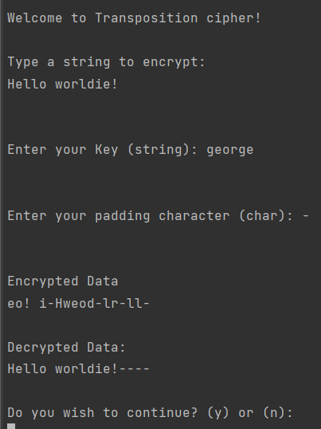

# Classical ciphers laboratory
In this laboratory I implemented 4 variations of classical ciphers:

* Caesar cipher
* Vigenere cipher
* Playfair cipher
* Transposition cipher.

This is a console application that allows you to test all these various ciphers until you want to 
quit the app. 

When you run you will be provided with 5 options:

4 of them will be the choice of cipher and the 5th option would be to quit the program.

In each of the ciphers you will be provided the choice of whether you want to quit or if you want to
encrypt a new message at the end of each cipher execution.

### Caesar cipher:

### Vigenere cipher:

### Playfair cipher:

### Transposition cipher:
