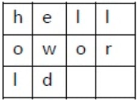
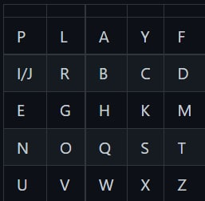
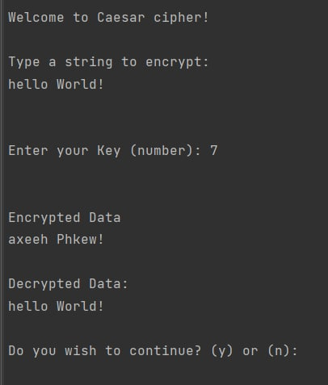
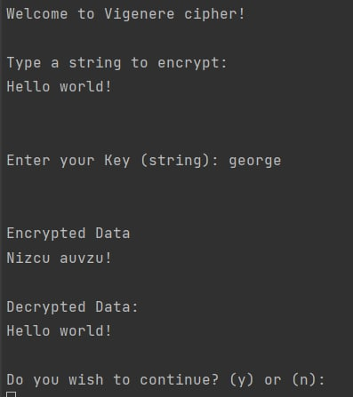
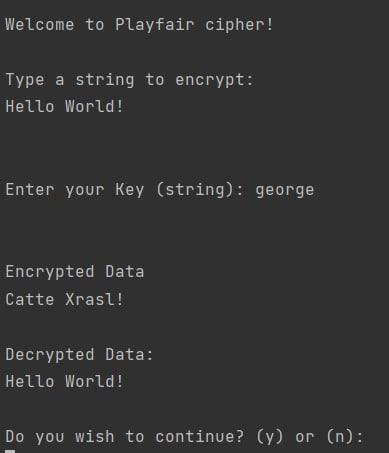
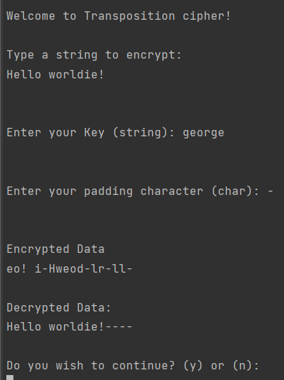

# Classical ciphers laboratory

#### Author: George Vragalev

## Theory
Cryptography is a branch of mathematics that deals with securing information, also ensuring authentication and restricting access in an informational system.

Classic cryptography falls under the class of symmetric key cryptography and is cryptography 
before the computer, hence the name pre-computational cryptography. In classic cryptography, 
algorithms were character-based and consisted of a series of elementary transformations 
(substitutions and transpositions) of plaintext characters.

#### Substitution ciphers
The substitution cipher is the cipher in which each character or group of characters of the plaintext m is replaced by another character or group of characters in the ciphertext c, decryption is done by applying reverse substitution on the encrypted text.

#### Monoalphabetic substitution ciphers
Monoalphabetic substitution ciphers (monoalphabetic ciphers) are the ciphers in which each plaintext character m is replaced by a corresponding ciphertext character c. One such example of the cipher is the Caesar cipher.

### The Caesar Cipher
In this cipher, each letter of the plaintext is replaced by a new letter obtained by an alphabetical shift. 
The secret key k, which is the same for encryption as and upon decryption, it consists of the number indicating the alphabetic displacement,
i.e. <math xmlns="http://www.w3.org/1998/Math/MathML">
<mi>k</mi>
<mo>&#x2208;</mo>
<mrow data-mjx-texclass="ORD">
<mn>1</mn>
<mo>,</mo>
<mn>2</mn>
<mo>,</mo>
<mn>3</mn>
<mo>,</mo>
<mo>&#x2026;</mo>
<mo>,</mo>
<mi>n</mi>
<mrow data-mjx-texclass="ORD">
<mo>&#x2013;</mo>
</mrow>
<mn>1</mn>
</mrow>
</math> , where n is the length of the alphabet. 

The encryption and decryption of the message with the Caesar cipher can be defined by the formulas 
where x and y are the numeric representation of the respective plaintext character.

Caesar's cipher is very easy to crack, so it is a very weak cipher. 
Thus, a cryptanalyst can get the plain text by trying all 25 keys.

### Transposition cipher
In cryptography, a transposition cipher, also known as columnar transposition cipher, 
is a simple and easy to implement cipher. 
This cipher follows a simple rule for mixing up the characters in the plaintext to form the ciphertext.

Although this cipher is weak on its own, but it can be combined with other ciphers, 
such as a substitution cipher,
the combination of which can be more difficult to break than either cipher on it's own.

A simple example for a transposition cipher is columnar transposition cipher where each character
in the plain text is written horizontally with specified alphabet width.
The cipher is written vertically, which creates an entirely different cipher text.

Consider the plain text hello world, and let us apply the simple columnar transposition 
technique as shown below:

The plain text characters are placed horizontally and the cipher text is created with vertical format as : holewdlo lr.
Now, the receiver has to use the same table to decrypt the cipher text to plain text.

### The Vigenere cipher
Like the Caesar cipher, the Vigenere cipher moves the letters, but unlike it, it cannot be easily
broken into 26 combinations. 
The Vigenere cipher uses a multiple shift. 
The key is not made up of a single shift, but of several, being generated by several integers k(i) ,
where 0 <= k(i) <= 25,
if we take the Latin alphabet with 26 letters as a reference.
Encryption is done as follows:
<math xmlns="http://www.w3.org/1998/Math/MathML">
<msub>
<mi>c</mi>
<mi>i</mi>
</msub>
<mo>=</mo>
<msub>
<mi>m</mi>
<mi>i</mi>
</msub>
<mo>+</mo>
<msub>
<mi>k</mi>
<mi>i</mi>
</msub>
<mo stretchy="false">(</mo>
<mi>m</mi>
<mi>o</mi>
<mi>d</mi>
<mtext>&#xA0;</mtext>
<mn>26</mn>
<mo stretchy="false">)</mo>
</math>

The key is usually a word, to be easier to remember and  represents the position of the key 
letter in the alphabet.

Decryption for the Vigenere cipher is similar to encryption. 
The difference is that the key is subtracted from the ciphertext:
<math xmlns="http://www.w3.org/1998/Math/MathML">
<msub>
<mi>m</mi>
<mi>i</mi>
</msub>
<mo>=</mo>
<msub>
<mi>c</mi>
<mi>i</mi>
</msub>
<mrow data-mjx-texclass="ORD">
<mo>&#x2013;</mo>
</mrow>
<msub>
<mi>k</mi>
<mi>i</mi>
</msub>
<mo stretchy="false">(</mo>
<mi>m</mi>
<mi>o</mi>
<mi>d</mi>
<mtext>&#xA0;</mtext>
<mn>26</mn>
<mo stretchy="false">)</mo>
</math>

The Vigenere cipher is a lot safer than the Caesar cipher for two reasons:

the first reason is that the others do not know the length of the key;
the second reason is that the number of possible solutions increases, for example, for the key length equal to 5, the number of combinations that would be necessary for the exhaustive search would be 11,881,376

### The Playfair cipher
A classic example for d-grams substitution is Playfair cipher.

The first letters in the above square (in general case - a rectangle) represent a keyword k
(the letters that are repeated are written once, in this example the key being k=Playfair)
, after which the square is completed with the letters of the alphabet in their natural order , 
without repetition. Then the encryption is executed according to the following rules:

1. The plaintext is separated in d-grams (pairs of letters)

2. A pair cannot have identical letter so for the separation of the identical letters, some separation characters are introduced which, as a rule, have a reduced occurrence frequency, such as the letter X. If the number of characters in the plaintext is odd, such a letter is added at the end of it. When deciphering, these added letters are omitted.

3. If m1 and m2 are in the same column in the above square then c1 and c2 are obtained by a cyclical displacement of m1 and m2 from top to bottom. For example AH → BQ and OV → VL;

4. If m1 and m2 are in the same row, then c1 and c2 are obtained by a cyclical movement to the right of the letters m1 and m2. For example PA → LY and NO → OQ;

5. If m1 and m2 are not in the same line or column, then c1 and c2 are the characters in the intersection of the line and columns. For example RK → CG and PZ → FU;

The deciphering is executed according to the rules similar to those of encryption, reversing the direction.

The use of the Playfair cipher currently does not make sense because modern laptops can easily break the cipher in seconds.

## Objectives

* Get familiar with the basics of cryptography and classical ciphers.

* Implement 4 types of the classical ciphers:
Caesar cipher,
Transposition cipher,
Vigenere cipher,
Playfair cipher.
* Structure the project in methods/classes/packages as neeeded.

## Implementation

In this laboratory I implemented 4 variations of classical ciphers:

* Caesar cipher
* Vigenere cipher
* Playfair cipher
* Transposition cipher.

This is a console application that allows you to test all these various ciphers until you want to 
quit the app. 

When you run you will be provided with 5 options:

4 of them will be the choice of cipher and the 5th option would be to quit the program.

In each of the ciphers you will be provided the choice of whether you want to quit or if you want to
encrypt a new message at the end of each cipher execution.

### Caesar cipher:

### Vigenere cipher:

### Playfair cipher:

### Transposition cipher:
