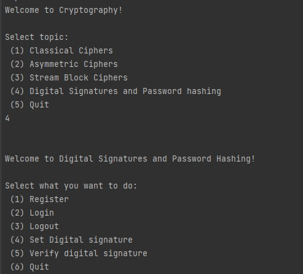
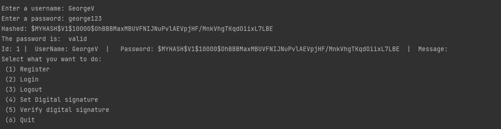
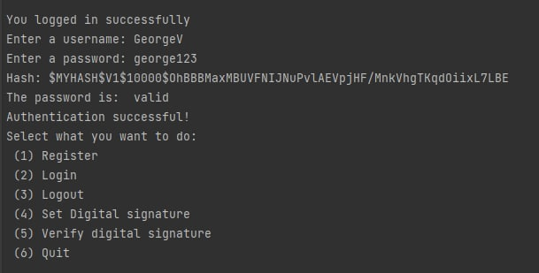
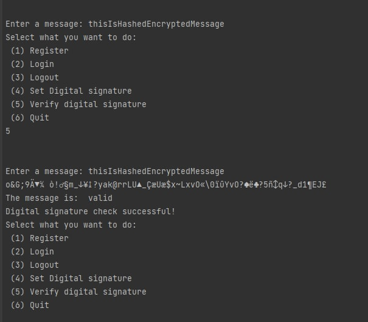
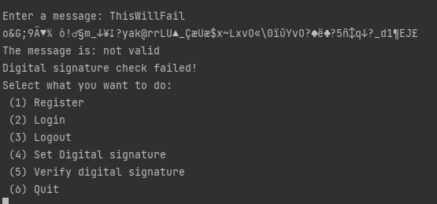

# Digital Signatures laboratory

#### Author: George Vragalev

## Overview
&ensp;&ensp;&ensp; Hashing is a technique used to compute a new representation of an existing value, message or any piece of text. The new representation is also commonly called a digest of the initial text, and it is a one way function meaning that it should be impossible to retrieve the initial content from the digest.

&ensp;&ensp;&ensp; Such a technique has the following usages:
* Offering confidentiality when storing passwords,
* Checking for integrity for some downloaded files or content,
* Creation of digital signatures, which provides integrity and non-repudiation.

&ensp;&ensp;&ensp; In order to create digital signatures, the initial message or text needs to be hashed to get the digest. After that, the digest is to be encrypted using a public key encryption cipher. Having this, the obtained digital signature can be decrypted with the public key and the hash can be compared with an additional hash computed from the received message to check the integrity of it.


## Examples
1. Argon2
2. BCrypt
3. MD5 (Deprecated due to collisions)
4. RipeMD
5. SHA256 (And other variations of SHA)
6. Whirlpool


## Objectives:
1. Get familiar with the hashing techniques/algorithms.
2. Use an appropriate hashing algorithms to store passwords in a local DB.
    1. You can use already implemented algortihms from libraries provided for your language.
    2. The DB choise is up to you, but it can be something simple, like an in memory one.
3. Use an asymmetric cipher to implement a digital signature process for a user message.
    1. Take the user input message.
    2. Preprocess the message, if needed.
    3. Get a digest of it via hashing.
    4. Encrypt it with the chosen cipher.
    5. Perform a digital signature check by comparing the hash of the message with the decrypted one.


## Implementation Description:

The implementation is based on real case of user login and registration.
The main idea behind this implementation is that it shows how password hashing and digital signatures 
can be used and applied.

When you run the program you will be presented with the area which you want to test and use.
You will have a console user interface to test infinitely all the functionalities of Login, Register and 
Message setting for each user.

You will be provided with the following options:


#### Register

The register options lets you create a user with a username and password which will e stored in an in memory 
list of users.
The password is hashed and stored in the user entity. It does so by calling the PasswordHasher by applying and salt that is generated 
at runtime and does so for a number of iterations. For extra security it is also formatted with extra information.
The saltsize and hashsize are determined inside the PasswordHasher class.
```c#
    /// <summary>
    /// Creates a hash from a password.
    /// </summary>
    /// <param name="password">The password.</param>
    /// <param name="iterations">Number of iterations.</param>
    /// <returns>The hash.</returns>
    public string Hash(string password, int iterations)
    {
        // Create hash
        var pbkdf2 = new Rfc2898DeriveBytes(password, salt, iterations);
        var hash = pbkdf2.GetBytes(HashSize);

        // Combine salt and hash
        var hashBytes = new byte[SaltSize + HashSize];
        Array.Copy(salt, 0, hashBytes, 0, SaltSize);
        Array.Copy(hash, 0, hashBytes, SaltSize, HashSize);

        // Convert to base64
        var base64Hash = Convert.ToBase64String(hashBytes);

        // Format hash with extra information
        return $"$MYHASH$V1${iterations}${base64Hash}";
    }
```



#### Login

After you have registered you can login with your user credentials that you created and it will get the user by name from the list
of users and the password input will be hashed again using the same procedure as for creating the user and then it will be compared with 
the password stored against the user, done by the Verify function

```c#
    /// <summary>
    /// Verifies a password against a hash.
    /// </summary>
    /// <param name="password">The password.</param>
    /// <param name="hashedPassword">The hash.</param>
    /// <returns>Could be verified?</returns>
    public bool Verify(string password, string hashedPassword)
    {
        // Check hash
        if (!IsHashSupported(hashedPassword))
        {
            throw new NotSupportedException("The hashtype is not supported");
        }

        // Extract iteration and Base64 string
        var splittedHashString = hashedPassword.Replace("$MYHASH$V1$", "").Split('$');
        var iterations = int.Parse(splittedHashString[0]);
        var base64Hash = splittedHashString[1];

        // Get hash bytes
        var hashBytes = Convert.FromBase64String(base64Hash);

        // Get salt
        Array.Copy(hashBytes, 0, salt, 0, SaltSize);

        // Create hash with given salt
        var pbkdf2 = new Rfc2898DeriveBytes(password, salt, iterations);
        byte[] hash = pbkdf2.GetBytes(HashSize);

        // Get result
        for (var i = 0; i < HashSize; i++)
        {
            if (hashBytes[i + SaltSize] != hash[i])
            {
                return false;
            }
        }

        return true;
    }
```

This is the output:


#### Set Digital Signature
This option lets you test out how digital signatures are working. The message is first hashed and then the digital signature is applied 
by encrypting the hash using a stream block cipher, the one I used is the DSE cipher. The message, when encrypted is 
saved to the logged in user. 

```c#
    public void SetDigitalSignature(User user)
    {
        Console.Write("Enter a message: ");
        string? message = Console.ReadLine();

        if (message == null)
        {
            return;
        }

        //hash
        var hash = _passwordHasher.Hash(message);

        var encryptedHash = _dse.Encrypt(hash);
        user.Message = encryptedHash;
    }
```

#### Verify Digital Signature
To verify the digital signature coorectly you have to enter the same message that you saved against your currently logged in user.
The message is decrypted using the DSE Decrypt algorithm and then the hash of the encrpyted message is compared to the decrypted message hash.


```c#
    public void VerifyDigitalSignature(User user)
    {
        Console.Write("Enter a message: ");
        string? message = Console.ReadLine();

        var decryptedHash = _dse.Decrypt(user.Message);

        // Verify
        var result = _passwordHasher.Verify(message, decryptedHash);
        Console.WriteLine($"Hash: {user.Message}");
        Console.WriteLine($"The message is: {(result ? "" : "not")} valid");
        Console.WriteLine($"Digital signature check {(result ? "successful" : "failed")}!");
    }
```

This is the output:



If you enter the wrong message the validation wil fail because the encryption will result in a totally different value and the 
digital signature rule will be applied.



#### Logout 
After you have done with your user message you can logout and create other users which will populate the database user list.


# Conclusion

Having implemented this laboratory work, I managed to understand how useful and safe password hashing is 
and how it is implemented in simple terms. It is safer than encrypting because an encryption can be decrypted 
however a hash is one way and can't be un-hashed. The hashing algorithms are very fast and can be used to check for integrity of large files.

Digital signatures provide a way to verify the
integrity of your data. The digital signature process is very useful for non-repudiation and integrity. This is useful at relevant stages of your application to check if data
hasn't benn corrupted, changed or modified with unauthorized access. This is done by hashing and encrypting the
hash which is stored in the database.

As an outcome at the verification step you can verify if the current data is
the same as the one that is saved by applying the same hash -> encryption principle.

