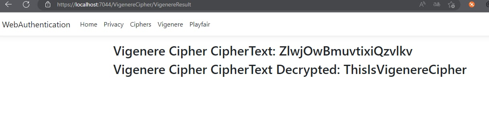

# Web Authentication & Authorisation. laboratory

#### Author: George Vragalev

## Theory
Authentication & authorization are 2 of the main security goals of IT systems and should not be used interchangibly. Simply put, during authentication the system verifies the identity of a user or service, and during authorization the system checks the access rights, optionally based on a given user role.

There are multiple types of authentication based on the implementation mechanism or the data provided by the user. Some usual ones would be the following:

* Based on credentials (Username/Password);
* Multi-Factor Authentication (2FA, MFA);
* Based on digital certificates;
* Based on biometrics;
* Based on tokens. 

Regarding authorization, the most popular mechanisms are the following:

* Role Based Access Control (RBAC): Base on the role of a user;
* Attribute Based Access Control (ABAC): Based on a characteristic/attribute of a user.


## Objectives

1. Take what you have at the moment from previous laboratory works and put it in a web service / serveral web services.
2. Your services should have implemented basic authentication and MFA (the authentication factors of your choice).
3. Your web app needs to simulate user authorization and the way you authorise user is also a choice that needs to be done by you.
4. As services that your application could provide, you could use the classical ciphers. Basically the user would like to get access and use the classical ciphers, but they need to authenticate and be authorized.


## Implementation

The security implementation aspect of this application is based on ASP.NET entity framework. 
It made possible the implementation of Secured login and registration as well as hash password storage.

The main security features of this framework include:
* Login
* Registration
* MFA 
* Email verification
* Password hashing
* Forgot password

```c#
/// <summary>
/// Gets or sets the email address for this user.
/// </summary>
[ProtectedPersonalData]
public virtual string Email { get; set; }

/// <summary>
/// Gets or sets the normalized email address for this user.
/// </summary>
public virtual string NormalizedEmail { get; set; }

/// <summary>
/// Gets or sets a flag indicating if a user has confirmed their email address.
/// </summary>
/// <value>True if the email address has been confirmed, otherwise false.</value>
[PersonalData]
public virtual bool EmailConfirmed { get; set; }

/// <summary>
/// Gets or sets a salted and hashed representation of the password for this user.
/// </summary>
public virtual string PasswordHash { get; set; }

/// <summary>
/// Gets or sets a flag indicating if two factor authentication is enabled for this user.
/// </summary>
/// <value>True if 2fa is enabled, otherwise false.</value>
[PersonalData]
public virtual bool TwoFactorEnabled { get; set; }
```

The app itself is comprised of secured and authenticated access to the Classical Ciphers.
It does so by securing the endpoints of the classical cipher methods from the controllers, meaning that the user can't access them 
without being authenticated. 

```c#
//security authorization annotation
[Authorize] 
public class CaesarCipherController : Controller
{
    //accessed from the navigation bar, form submission view
    public ActionResult CaesarCipher()
    {
        return View();
    }
    
    //called from view post form, which returns the result
    [HttpPost]
    public ActionResult CaesarResult(CaesarCipherModel cipher)
    {
        var caesarCipher = new Caesar(cipher.PlainText, cipher.Key);
        
        var cipherText = caesarCipher.Encipher();

        var plainText = caesarCipher.Decipher();
        cipher.CipherText = cipherText;
        cipher.PlainText = plainText;

        return View(cipher);
    }
}
```

So if you try to access the endpoint of a classical cipher you will be redirected to login,
and only then you will have access.


Once you run the app you will be on the home page where you can navigate yourself to login and register
since the cipher methods need authentication.


You fill in the registration form with you email and password. There are two password fields so
they have to match, otherwise you will have a password validation message indicating that the passwords don't match.


After you have submitted your registration form you will have to confirm your email. You can setup 
email confirmation, or do so by clicking the link to confirm your email.


You have now fully registered, and can authenticate with your credentials in the login page


You can go to your profile and setup multi factor authentication by configuring the app.
You can use apps like Microsoft or Google Authenticator by copying the key and entering it 
in the app.


Once you have setup the authetication for your email in the app, you will have time-based 
6-digit verification codes that you will have to enter on each login attempt.

After you enter this code after you will have mfa linked to this email.


So now if you try to login again, you will be prompted to enter the code generated by the 
authentication app.


Now that you have autheticated you can proceed to use the classical ciphers functionality


### Caesar cipher:

Enter a integer key and the plaintext you want to encrypt


You will get the result on screen as well as that result decrypted again.


### Vigenere cipher:

Enter a key and the plaintext you want to encrypt


You will get the result on screen as well as that result decrypted again.



### Playfair cipher:

Enter a key and the plaintext you want to encrypt


You will get the result on screen as well as that result decrypted again.


## Conclusion

Having implemented this web application, we can conclude that in order to have a secured app 
you need to be able to restrict access to features that are for privileged users. This is done
so by implementing secured login and storage of password hash in a local app database (check db context migration to see columns).

The app has features that make it even better with email verification, password reset, 
dynamic multi-factor authentication as well as supplementary verification codes 
that are generated in case you lose access to your authenticator and can enter them in case of 
emergency.