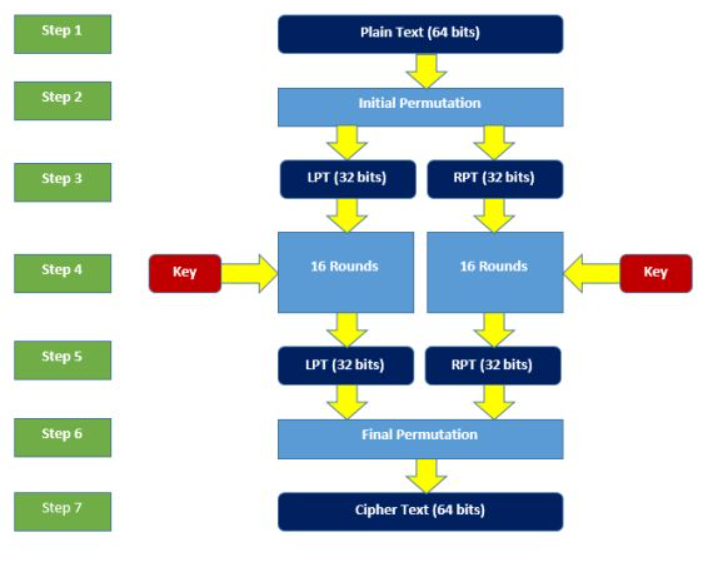
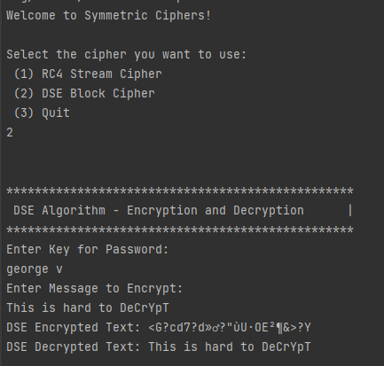
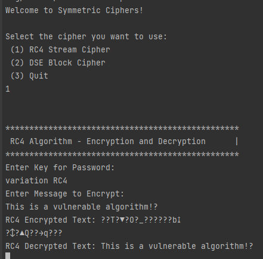

# Classical ciphers laboratory

#### Author: George Vragalev

## Theory
Cryptography is a branch of mathematics that deals with securing information, also ensuring authentication and restricting access in an informational system.

Classic cryptography falls under the class of symmetric key cryptography and is cryptography 
before the computer, hence the name pre-computational cryptography. In classic cryptography, 
algorithms were character-based and consisted of a series of elementary transformations 
(substitutions and transpositions) of plaintext characters.

## Objectives

* Get familiar with the symmetric cryptography, stream and block ciphers.
* Implement an example of a stream cipher.
* Implement an example of a block cipher.
* Structure the project in methods/classes/packages as neeeded.

## Implementation

In this laboratory I implemented 2 types of symmetrical ciphers:
* Block cipher - Data Encryption Standard (DES)
* Stream cipher - Rivest Cipher 4 (RC4)

This is a console application that allows you to test all these ciphers until you want to 
quit the app. 

When you run you will be provided with 3 options:

2 of them will be the choice of cipher and the 3rd option would be to quit the program.

### Block cipher - Data Encryption Standard (DES):
DES was developed by IBM in the 1970s and later standardized in public by the NSA in 1977. 
It is a block cipher. It encrypts the data in the blocks of size of 64 bits each. 
DES uses heavily bit operations. It uses a key of 56 bit length. 
The same algorithm and the key is used for decryption process.

The original key is of 64 bit length. For parity checking purposes, 
every 8th bit is discarded from the original key, making it a key of 56 bit length.

ASCII value of each character from the plain text and the key and converted to the binary digits of 8 bit length. 
Now, this is what happens that the total length of the plain text and the key may not be an exact multiple of 64. 
Thus, I appended zeroes at the end of the plain text and the key in such a way that they become a 
multiple of 64. One important thing to note is that the key size cannot be greater than 8 characters.
As each character represents 8 bits and the size of key cannot be greater than 64 bits, hence the key size 
cannot be more than 8 characters.

Now, divide the plain text in the blocks of 64 bits. Take each block, one by one. 
Start encrypting them with DES. DES involves the steps, given below.

Program run:

### Stream cipher - Rivest Cipher 4 (RC4):

RC4 (Rivest Cipher 4) was designed by Ron Rivest. It is remarkable for its speed and simplicity. 
It widely used in many applications and protocols. 
Though, there are multiple Vulnerability has been discovered in RC4.

It encrypt/decrypt input data one by one. 
In this way, the encryption or decryption can be implemented on the length of the variable. 
This algorithm does not have to wait a certain amount of data input before it is processed or add 
extra bytes to encrypt.

RC4 encryption and decryption process mainly divided into 2 part:

#### Key-scheduling algorithm (KSA)

In key scheduling algorithm it generates random key is for 256 char called as s-box initialization where first,
S [0], S [1], …, S [255], with the numbers 0 to 255.
Key will be created in another array K [0], K [1], …, K [255] to create s-box;

#### Pseudo-random generation algorithm:

It uses to encrypt/decrypt the data one by one, so each key byte 
S[i] algorithm swap it with another byte in S[j] then bitwise exclusive or XOR two binary bits

Program run:

